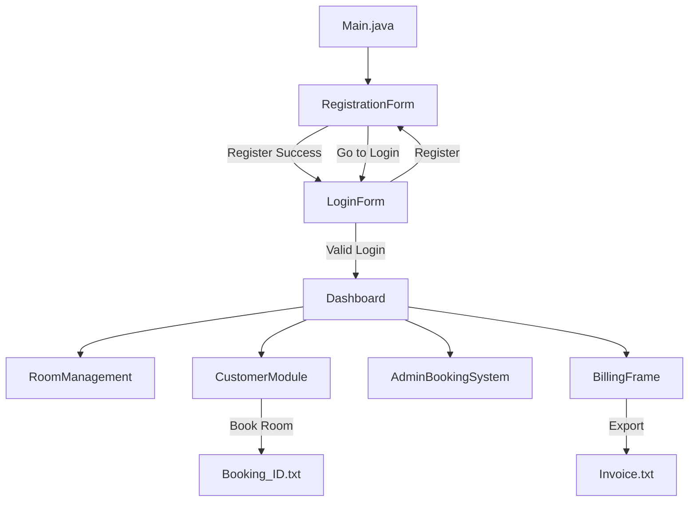

# Hotel Management System

A desktop **Hotel Management System** built with **Java Swing**. It provides a graphical interface for hotel staff to manage rooms, customers, bookings, and billing from a single application. The project is designed as an educational/demo application with in-memory data storage and optional file export for bookings and invoices.

---

## Table of Contents

- [Overview](#overview)
- [Features](#features)
- [Technology Stack](#technology-stack)
- [System Architecture](#system-architecture)
- [Project Structure](#project-structure)
- [Module Guide](#module-guide)
- [Application Flow](#application-flow)
- [Room Types & Pricing](#room-types--pricing)
- [Billing & Tax Calculation](#billing--tax-calculation)
- [Data Persistence](#data-persistence)
- [Prerequisites](#prerequisites)
- [Installation & Setup](#installation--setup)
- [How to Run](#how-to-run)
- [Usage Walkthrough](#usage-walkthrough)
- [UI Design](#ui-design)
- [Known Limitations](#known-limitations)
- [Future Enhancements](#future-enhancements)
- [Troubleshooting](#troubleshooting)
- [Contributing](#contributing)
- [License](#license)

---

## Overview

The **Hotel Management System** is a Java-based desktop application that simulates core hotel operations. Users register an account, log in, and access a central dashboard from which they can:

- Manage hotel rooms (add, view, update, delete)
- Handle customer bookings (search, book, view, cancel)
- Administer bookings with status tracking
- Generate invoices with GST and export them to text files

The application uses **Swing (AWT)** for the user interface and stores most operational data **in memory** during runtime. Booking confirmations and invoices can be saved as `.txt` files on disk.

> **Note:** This is a demo/educational project. It does not connect to a database and credentials are stored in static variables (not suitable for production use).

---

## Features

### Authentication
| Feature | Description |
|---------|-------------|
| User Registration | Create a username and password with validation |
| Login | Authenticate against registered credentials |
| Password Visibility Toggle | Show/hide password during registration |
| System Reset | Clear all saved account data |
| Auto-redirect | Redirects to login after successful registration |

### Dashboard
| Feature | Description |
|---------|-------------|
| Central Hub | Single entry point to all modules |
| Room Management | Navigate to room CRUD operations |
| Customer Module | Navigate to customer-facing booking flow |
| Admin Booking System | Navigate to admin booking management |
| Billing & Reports | Navigate to invoice generation |

### Room Management
| Feature | Description |
|---------|-------------|
| Add Room | Register new rooms with type, price, floor, amenities |
| View All Rooms | Display complete room inventory |
| Update Room | Modify existing room details by room number |
| Delete Room | Remove rooms from inventory |
| Amenities | AC, WiFi, TV checkboxes |
| Status Tracking | Available, Occupied, Maintenance |
| Sample Data | Pre-loaded with 5 demo rooms on startup |

### Customer Module
| Feature | Description |
|---------|-------------|
| Room Search | Search available rooms by date and type |
| Room Booking | Book rooms with customer details |
| View Bookings | List all bookings made in current session |
| Cancel Booking | Cancel bookings by booking ID |
| File Export | Saves booking confirmation to `Booking_<ID>.txt` |
| Input Validation | Phone number must be numeric; required fields enforced |

### Admin Booking System
| Feature | Description |
|---------|-------------|
| Add Booking | Create bookings with ID, customer, dates, status |
| View All Bookings | Display all bookings in the system |
| Update Status | Change booking status (Booked, Checked-In, Checked-Out, Cancelled) |
| Cancel Booking | Mark bookings as cancelled |
| Availability Report | View 30-day availability summary |
| Sample Data | Pre-loaded with 4 demo bookings |

### Billing & Reports
| Feature | Description |
|---------|-------------|
| Invoice Generation | Calculate room charges, add-ons, CGST, SGST |
| Add-On Services | Beverages, Laundry, Food, WiFi, Extra Bed |
| Export Invoice | Save invoice to a user-selected `.txt` file |
| Validation | 10-digit mobile number, required fields, numeric checks |

---

## Technology Stack

| Component | Technology |
|-----------|------------|
| Language | Java (JDK 8+) |
| GUI Framework | Java Swing / AWT |
| Layout | Absolute positioning (`setLayout(null)`) |
| Data Storage | In-memory (`ArrayList`, static variables) |
| File I/O | `java.io.FileWriter`, `JFileChooser` |
| Build | Manual compilation (`javac`) — no Maven/Gradle |

---

## System Architecture

The application follows a **modular, frame-based architecture**. Each major feature is implemented as a separate `JFrame` class. Navigation between modules is handled by instantiating new frames from button click events.



### Class Relationships

```
hotelmanagement/
├── Main.java                 → Application entry point
├── RegistrationForm.java     → User registration (static credential storage)
├── LoginForm.java            → Authentication
├── Dashboard.java            → Main navigation hub
├── RoomManagement.java       → Room CRUD (in-memory ArrayList)
├── CustomerModule.java       → Customer bookings + file export
├── AdminBookingSystem.java   → Admin booking management
└── BillingFrame.java         → Invoice generation
    └── Invoice (inner class) → Tax & total calculation
```

---

## Project Structure

```
HotelManagement/
│
├── README.md                          # Project documentation
├── Booking_1.txt                      # Sample booking confirmation file
│
└── hotelmanagement/
    ├── Main.java                      # Entry point — launches RegistrationForm
    ├── RegistrationForm.java          # Account creation & credential storage
    ├── LoginForm.java                 # User authentication
    ├── Dashboard.java                 # Main menu / navigation
    ├── RoomManagement.java            # Room inventory management
    ├── CustomerModule.java            # Customer booking interface
    ├── AdminBookingSystem.java        # Admin booking operations
    ├── BillingFrame.java              # Billing, invoicing & export
    │
    └── *.class                        # Compiled bytecode (generated by javac)
```

---

## Module Guide

### 1. Main (`Main.java`)

The application entry point. Launches the **Registration Form** on startup.

```java
public static void main(String[] args) {
    new RegistrationForm();
}
```

---

### 2. Registration Form (`RegistrationForm.java`)

Handles new user account creation.

**Static credential storage:**
```java
static String savedUser = "";
static String savedPass = "";
```

| Button | Action |
|--------|--------|
| Register | Saves username/password and redirects to login after 1 second |
| Go to Login | Opens login form |
| Clear Fields | Clears input fields |
| Reset System | Clears all saved credentials |
| 👁️ (Eye) | Toggles password visibility |

---

### 3. Login Form (`LoginForm.java`)

Authenticates users against credentials stored in `RegistrationForm`.

**Login logic:**
1. Validates that username and password are not empty
2. Checks that a user has been registered
3. Compares input against `RegistrationForm.savedUser` and `RegistrationForm.savedPass`
4. On success → opens `Dashboard` and closes login window

---

### 4. Dashboard (`Dashboard.java`)

Central navigation hub with four module buttons:

| Button | Opens |
|--------|-------|
| Room Management | `RoomManagement` |
| Customer Module | `CustomerModule` |
| Booking System | `AdminBookingSystem` |
| Billing & Reports | `BillingFrame` |

Window size: **600 × 550 pixels**

---

### 5. Room Management (`RoomManagement.java`)

Full CRUD operations for hotel rooms stored in an `ArrayList<String>`.

**Room record format:**
```
<RoomNo> | <Type> | ₹<Price> | <Status> | Floor-<N> | <Amenities>
```

**Example:**
```
101 | Single | ₹1500 | Available | Floor-1 | AC, WiFi
```

**Pre-loaded sample rooms:**

| Room | Type | Price | Status | Floor | Amenities |
|------|------|-------|--------|-------|-----------|
| 101 | Single | ₹1,500 | Available | 1 | AC, WiFi |
| 201 | Double | ₹2,500 | Available | 2 | AC, WiFi, TV |
| 301 | Deluxe | ₹4,000 | Occupied | 3 | AC, WiFi, TV |
| 401 | Suite | ₹7,000 | Available | 4 | AC, WiFi, TV |
| 501 | Presidential | ₹12,000 | Maintenance | 5 | AC, WiFi, TV |

**Room types:** Single, Double, Deluxe, Suite, Presidential  
**Status options:** Available, Occupied, Maintenance

---

### 6. Customer Module (`CustomerModule.java`)

Customer-facing booking interface.

**Search Rooms** returns hardcoded availability:

| Room ID | Type | Rate |
|---------|------|------|
| R101 | Deluxe | ₹3,000/night |
| R102 | Suite | ₹4,500/night |
| R103 | Presidential | ₹8,000/night |

**Booking flow:**
1. Enter check-in/check-out dates
2. Select room type (Deluxe, Suite, Presidential)
3. Search available rooms
4. Fill customer name, email, phone
5. Click **Book Room**
6. System generates a booking ID and writes `Booking_<ID>.txt`

**Sample booking file (`Booking_1.txt`):**
```
========= BOOKING CONFIRMATION =========
Booking ID: 1
Name: neel
Email: avc
Phone: 7839
Room Type: Presidental
Check-In: 2025-11-01
Check-Out: 2025-11-03
Status: CONFIRMED
```

---

### 7. Admin Booking System (`AdminBookingSystem.java`)

Administrative booking management with status lifecycle.

**Booking record format:**
```
<ID> | <Customer Name> | <Check-In> | <Check-Out> | <Status>
```

**Status options:** Booked, Checked-In, Checked-Out, Cancelled

**Pre-loaded sample bookings:**

| ID | Customer | Check-In | Check-Out | Status |
|----|----------|----------|-----------|--------|
| 1 | Amit Kumar | 2025-11-23 | 2025-11-25 | Booked |
| 2 | Riya Sharma | 2025-11-24 | 2025-11-26 | Booked |
| 3 | Priya Singh | 2025-11-25 | 2025-11-27 | Checked-In |
| 4 | Rahul Verma | 2025-11-26 | 2025-11-28 | Booked |

**Availability report** shows a 30-day summary with weekly availability and totals:
- Total Rooms: 50
- Booked: dynamic count
- Available: 50 − booked count

---

### 8. Billing Frame (`BillingFrame.java`)

Generates hotel invoices with Indian GST (CGST + SGST).

**Add-on services:**

| Service | Price |
|---------|-------|
| Beverages | ₹150 |
| Laundry | ₹300 |
| Food Service | ₹500 |
| WiFi | ₹100 |
| Extra Bed | ₹400 |

**Invoice inner class (`Invoice`):**
```java
double roomAmount = rate * nights;
double gross = roomAmount + addons;
this.cgst = gross * 0.09;   // 9% CGST
this.sgst = gross * 0.09;   // 9% SGST
this.total = gross + cgst + sgst;
```

**Sample invoice output:**
```
******** HOTEL INVOICE ********
Customer Name  : John Doe
Mobile Number  : 9876543210
Nights         : 3
Room Rate      : ₹3000.0
Add-Ons        : ₹650.0
CGST (9%)      : ₹985.5
SGST (9%)      : ₹985.5
--------------------------------
TOTAL AMOUNT   : ₹12921.0
**
```

---

## Application Flow

```
┌─────────────────────────────────────────────────────────────┐
│                     APPLICATION STARTUP                      │
│                         Main.java                            │
└─────────────────────────┬───────────────────────────────────┘
                          │
                          ▼
┌─────────────────────────────────────────────────────────────┐
│                   REGISTRATION FORM                          │
│  • Create username & password                                │
│  • Toggle password visibility                                │
│  • Reset system / Clear fields                               │
└──────────────┬──────────────────────────┬───────────────────┘
               │ Register OK               │ Go to Login
               ▼                           ▼
┌──────────────────────────┐   ┌──────────────────────────────┐
│      LOGIN FORM          │   │      LOGIN FORM              │
│  • Validate credentials  │   │                              │
└──────────────┬───────────┘   └──────────────────────────────┘
               │ Login Success
               ▼
┌─────────────────────────────────────────────────────────────┐
│                       DASHBOARD                              │
│  ┌─────────────┐ ┌─────────────┐ ┌─────────────┐ ┌─────────┐│
│  │    Room     │ │  Customer   │ │   Admin     │ │ Billing ││
│  │ Management  │ │   Module    │ │  Booking    │ │ Reports ││
│  └─────────────┘ └─────────────┘ └─────────────┘ └─────────┘│
└─────────────────────────────────────────────────────────────┘
```

---

## Room Types & Pricing

The system uses two pricing contexts:

### Room Management (Inventory)
Used when managing the hotel's room inventory.

| Type | Sample Price |
|------|-------------|
| Single | ₹1,500 |
| Double | ₹2,500 |
| Deluxe | ₹4,000 |
| Suite | ₹7,000 |
| Presidential | ₹12,000 |

### Customer Module (Booking Search)
Used when customers search for available rooms.

| Room | Type | Nightly Rate |
|------|------|-------------|
| R101 | Deluxe | ₹3,000 |
| R102 | Suite | ₹4,500 |
| R103 | Presidential | ₹8,000 |

---

## Billing & Tax Calculation

The billing module applies **18% GST** split equally:

| Tax | Rate | Applied On |
|-----|------|-----------|
| CGST | 9% | Gross amount (room + add-ons) |
| SGST | 9% | Gross amount (room + add-ons) |

**Formula:**
```
Room Amount  = Room Rate × Number of Nights
Gross Amount = Room Amount + Add-On Services Total
CGST         = Gross Amount × 0.09
SGST         = Gross Amount × 0.09
Total        = Gross Amount + CGST + SGST
```

**Example calculation:**
- Room Rate: ₹3,000/night × 3 nights = ₹9,000
- Add-ons: Beverages (₹150) + Food (₹500) = ₹650
- Gross: ₹9,650
- CGST (9%): ₹868.50
- SGST (9%): ₹868.50
- **Total: ₹11,387.00**

---

## Data Persistence

| Data Type | Storage | Persists After Restart? |
|-----------|---------|------------------------|
| User credentials | Static variables in `RegistrationForm` | No |
| Room inventory | `ArrayList` in `RoomManagement` | No (reloaded with sample data) |
| Customer bookings | `ArrayList` in `CustomerModule` | No |
| Admin bookings | `ArrayList` in `AdminBookingSystem` | No (reloaded with sample data) |
| Booking confirmations | `Booking_<ID>.txt` files | Yes |
| Invoices | User-selected `.txt` via file chooser | Yes |

---

## Prerequisites

Before running the application, ensure you have:

| Requirement | Minimum Version |
|-------------|----------------|
| Java Development Kit (JDK) | 8 or higher |
| Operating System | Windows, macOS, or Linux |
| Display | GUI-capable environment (for Swing) |

**Verify Java installation:**
```bash
java -version
javac -version
```

---

## Installation & Setup

### 1. Clone the repository

```bash
git clone https://github.com/Neel-2606/HotelManagement.git
cd HotelManagement
```

### 2. Compile all Java source files

**Windows (PowerShell / CMD):**
```bash
javac hotelmanagement/*.java
```

**Linux / macOS:**
```bash
javac hotelmanagement/*.java
```

This generates `.class` files in the `hotelmanagement/` directory.

---

## How to Run

### Run the full application (recommended)

```bash
java hotelmanagement.Main
```

This opens the **Registration Form**, which is the intended entry point.

### Run individual modules (for testing)

Each module can be launched independently via its own `main` method:

```bash
# Customer Module only
java hotelmanagement.CustomerModule

# Room Management only
java hotelmanagement.RoomManagement

# Admin Booking System only
java hotelmanagement.AdminBookingSystem
```

> **Note:** Running modules independently bypasses login. Use `Main` for the complete authenticated flow.

---

## Usage Walkthrough

### Step 1 — Register an account
1. Launch the application
2. Enter a username and password
3. Click **Register**
4. You will be redirected to the login screen automatically

### Step 2 — Log in
1. Enter your registered username and password
2. Click **Login**
3. The Dashboard opens on success

### Step 3 — Manage rooms
1. Click **Room Management** on the Dashboard
2. Use **View All** to see pre-loaded sample rooms
3. Fill in room details and click **Add Room** to add new rooms
4. Enter a room number and click **Update Room** or **Delete Room** as needed

### Step 4 — Create a customer booking
1. Click **Customer Module** on the Dashboard
2. Set check-in/check-out dates
3. Select a room type and click **Search Rooms**
4. Enter customer name, email, and phone
5. Click **Book Room**
6. A `Booking_<ID>.txt` file is created in the project root

### Step 5 — Administer bookings
1. Click **Booking System** on the Dashboard
2. Use **View All** to see existing bookings
3. Add new bookings or update status using booking ID
4. Click **Availability** for a 30-day summary

### Step 6 — Generate an invoice
1. Click **Billing & Reports** on the Dashboard
2. Enter customer name, mobile (10 digits), nights, and room rate
3. Select add-on services
4. Click **Generate Invoice** to preview
5. Click **Export Invoice** to save as a `.txt` file

---

## UI Design

The application uses a consistent visual theme across all modules:

| Element | Style |
|---------|-------|
| Background | Light blue `#E6FAFF` (230, 250, 255) |
| Headings | Serif Bold, blue `#0066CC` |
| Labels | Arial Bold, dark blue `#003366` |
| Display areas | Cream `#FFFFE6` with titled borders |
| Primary buttons | Green `#00994C`, Blue `#3399FF` |
| Warning buttons | Orange `#FF9933`, Red `#CC0000` |
| Layout | Absolute positioning with `setBounds()` |
| Window placement | Centered via `setLocationRelativeTo(null)` |

Emoji icons are used throughout button labels and headings for visual clarity (e.g., 🏨, 🔐, 🛏️, 💰).

---

## Known Limitations

| Limitation | Details |
|------------|---------|
| No database | All data is stored in memory and lost on application restart |
| Single user | Only one account can be registered at a time (static variables) |
| Plain-text passwords | Credentials are stored without encryption |
| No date validation | Check-in/check-out dates are free-text, not validated |
| Disconnected modules | Room Management, Customer Module, and Admin Booking do not share data |
| Hardcoded room search | Customer module returns fixed room list regardless of dates |
| Sample data reload | Room and Admin modules reload demo data on each open |
| No email integration | Booking confirmations are file-only, not emailed |
| Compiled `.class` files in repo | Bytecode is committed alongside source (not ideal for version control) |

---

## Future Enhancements

Potential improvements for a production-ready version:

- [ ] **MySQL / SQLite integration** — Persistent storage for rooms, bookings, and users
- [ ] **Multi-user support** — Role-based access (Admin, Receptionist, Customer)
- [ ] **Password hashing** — Secure credential storage (BCrypt, SHA-256)
- [ ] **Date picker widgets** — `JDateChooser` or custom calendar for date selection
- [ ] **Shared data layer** — Central service/DAO connecting all modules
- [ ] **PDF invoice export** — Generate printable PDF invoices
- [ ] **Email notifications** — Send booking confirmations via SMTP
- [ ] **Room availability logic** — Real date-range conflict checking
- [ ] **Reporting dashboard** — Revenue charts, occupancy rates, analytics
- [ ] **Build tool integration** — Maven or Gradle for dependency and build management
- [ ] **Unit tests** — JUnit tests for business logic (Invoice, booking validation)
- [ ] **Logging** — `java.util.logging` or Log4j for audit trails

---

## Troubleshooting

### Application won't start
```bash
# Ensure JDK is installed
java -version

# Recompile if .class files are missing or outdated
javac hotelmanagement/*.java

# Run from project root
java hotelmanagement.Main
```

### "No user registered" on login
Register a new account first via the Registration Form before attempting to log in.

### "Invalid username or password"
Credentials are case-sensitive. Use **Reset System** on the registration form to clear and re-register.

### Booking file not created
Ensure the application has write permissions in the project directory. Check for `Booking_<ID>.txt` in the root folder.

### GUI not displaying correctly
Ensure you are running in a desktop environment with a display. Swing requires a GUI-capable session (not headless server mode).

### ClassNotFoundException
Run commands from the **project root** directory (`HotelManagement/`), not from inside `hotelmanagement/`.

---

## Contributing

Contributions are welcome. To contribute:

1. Fork the repository
2. Create a feature branch (`git checkout -b feature/your-feature`)
3. Commit your changes (`git commit -m "Add your feature"`)
4. Push to the branch (`git push origin feature/your-feature`)
5. Open a Pull Request

Please follow existing code style (Swing absolute layout, consistent color theme, emoji-labeled buttons).

---

## License

This project is open source and available for educational purposes.  
Repository: [https://github.com/Neel-2606/HotelManagement](https://github.com/Neel-2606/HotelManagement)

---

<p align="center">
  Built with Java Swing · Hotel Management System · Demo Application
</p>
